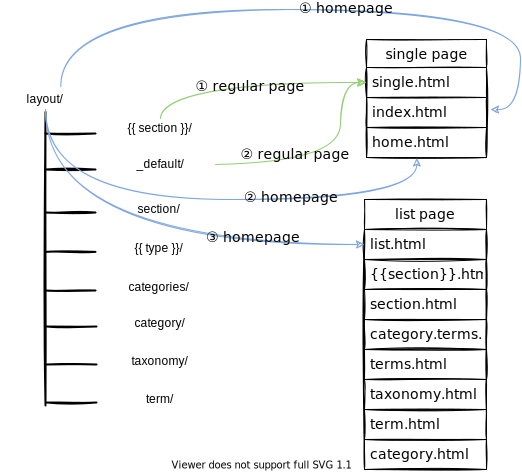

对于刚接触hugo的人，阅读本文将了解hugo组织内容的方式，掌握CONTENT、URL、TEMPALTE三者的关系，从结构上理解hugo。本文只介绍内容模板，baseof模板规律也大同小异。

<!--more-->

---

# 从URL到一篇文章


当访问一个静态网页，会通过URL定位到所需页面，如上图。hugo生成的页面由两部分组成，一部分是页面的框架，另一部分是页面的内容，分别对应模板和文章。所以我们使用hugo搭建Blog时，需要设计两层对应关系：

- 内容和URL的对应关系
- 内容和模板的对应关系

内容可以是我们所写的一篇文章，即一个md文件，也可以是一个文章列表，列出某个类别下所有文章。hugo为我们自动生成两种列表页面，一个是分类页面(category page)，另一个是标签页面(taxonomy page)。我们无需人工指定这两个页面的内容，只需在文章的扉页(front matter)给定categories和tags属性，hugo自动为我们分类并创建列表页面。

还有一种列表页面需要我们定义，即section页面。section为我们提供了一种组织文章的方式，通过构建content的目录结构，我们可以任意分类文章。打个恰当的比方，文章和section的关系类似文件和文件夹的关系。

下面先简单介绍下section。

## section

### 定义section

>  section的元数据由其下的_index.md定义，内容由其下文章构成。

- `content/`下一级目录为section
- 其他目录中包含_index.md即为section

```go
content
└── blog        <-- Section, content下的一级目录
    ├── funny-cats
    │   ├── mypost.md
    │   └── kittens         <-- Section, 含有 _index.md
    │       └── _index.md
    └── tech                <-- Section, 含有 _index.md
        └── _index.md
```

文章扉页模板和页面模板的位置也和section有关，如`archetypes/{{section}}/default.md`和`layouts/{{section}}/single.html`。

### section使用的例子

创建`content/posts/_index.md`，内容如下

```yaml
---
title: My Go Journey
date: 2017-03-23
publishdate: 2017-03-24
---

I decided to start learning Go in March 2017.

Follow my journey through this new blog.
```

在模板中展示section内容：`layouts/_default/list.html`

```html
{{ define "main" }}
<main>
    <article>
        <header>
            <h1>{{.Title}}</h1> <!--如果_index.md没定义，Title为section name，即posts，否则为文章标题，即扉页中的title属性值-->
        </header>
        {{.Content}} <!-- "{{.Content}}" 为_index.md中的内容，如果没定义则为空 -->
    </article>
    <ul>
    <!-- Ranges through content/posts/*.md -->
    {{ range .Pages }}
        <li>
            <a href="{{.Permalink}}">{{.Date.Format "2006-01-02"}} | {{.Title}}</a>
        </li>
    {{ end }}
    </ul>
</main>
{{ end }}
```

# 内容和URL的对应关系

content的目录结构决定了内容和URL的对应关系，其中section起着重要作用。

section在content目录下是一个文件夹，在页面中为一个列表页面。

不同页面类型和内容类型对应的URL如下表所示：

| 页面类型 | 内容类型 | 说明         | URL                       |
| -------- | -------- | ------------ | ------------------------- |
| single   | regular  | 常规内容页面 | `/{{section}}/{{title}}/` |
|          | home     | 主页         | `/`                       |
| list     | section  | section页面  | `/{{section}}/`           |
|          | taxonomy | 分类页面     | `/tags/`                  |
|          | term     | 特定类别页面 | `/tags/{{term}}/`         |
|          | category | 分类页面     | `/categories/`            |


# 内容和模板的对应关系

> hugo会根据页面的类型寻找对应的模板

模板位于layouts目录下，如果使用主题，则在`themes/{{theme}}/layouts/`下。其目录结构和页面的内容类型相对应，每个类型一个文件夹，如下图。其中`_default/`是默认模板的存放位置，如果没有对应内容类型的模板，则在此下寻找模板。

这里特别说明的是页面的type属性，`{{type}}/`文件夹下的模板是根据文章的type属性进行匹配，type由文章扉页来定义，默认值为文章所在目录的名称，所以缺损值和`{{section}}`一致。


hugo选择渲染模板的主要依据：**内容类型**

比较特殊的是主页，其模板就位于layouts根目录下，一般为`layouts/index.md`。

hugo所有页面可以简单分为single page和list page，下面分别介绍single page和list page的模板选择规律。

## single page

> 由单一的文章或者非列表内容组成的页面称为single page。

### 模板名称

常规页面内容就是一篇文章的内容，模板名称为`single.html`。而主页的模板名称为`index.html`或`home.html`，当然主页也可以显示列表内容，最简单的做法就是把`layouts/_default/list.html/`复制到`layouts/index.html`。


### 模板路径

single page的模板路径和模板名称的对应关系如下图，编号为优先级关系。

最佳实践:

- 常规文章页面使用`layouts/{{section}}/single.html`作为模板。
- 主页使用`layouts/index.html`作为模板。



## list page

> 许多文章标题和摘要组成的页面称为列表页面(list page)。

taxonomy和term页面由hugo根据每个文章扉页定义的tags自动生成。

section页面会根据其下文章和_index.md内容生成。

### 模板名称

列表页面的模板名称根据列表页面各有不同，默认是`list.html`。


这里可以为每种类型的列表页面都定义模板，如果没给定模板，所有列表页面都使用`layouts/_default/list.html`模板。本文最后的例子可以作参考。

### 模板路径

section和taxonomy页面的模板优先级如下图，分别用蓝色和红色线条表示。其中taxonomy页面最常用的模版名为`terms.html`，用于展示所有tags。

hugo根据扉页的设置，默认对文章进行两个维度的分类：

- tag -> `/tags/`
- category -> `/categories/`

这两个页面都是列表页面，大多数情况使用相同的模板。


当你进入到某一tag后，就进入了term页面，模板优先级如下图。在term页面中，会列出该tag下的所有文章标题。


# 最佳实践

这里以[Aozaki's Blog](https://github.com/aozaki-kuro/Aozaki)为例，适当简化，下图是`content/`目录结构，posts是一个section，里面每个文件夹是一篇文章，index.md为文章内容。

可能你会疑惑为何要在section下再嵌套一层文件夹，其实这么做主要目的是让图片和文章能放在同一级目录，这样就可以在markdown文件中使用相对路径引用图片，无论是使用`hugo server -D`进行预览还是构建到`public/`下，图片都能正常显示。熟悉nginx的小伙伴应该知道，如果URL访问的是一个文件夹，则返回其下的index.html。这里也是同样的道理，当访问`/posts/{{article_name}}/`，其实会返回index.md的内容。

category页面和taxonomy页面都使用`layouts/taxonomy/`下的模板进行渲染。

```powershell
content/
└─posts/ # section
    │  about.md #模板：layouts/posts/single.html #URL：/about/
    ├─2020-08-04 Ghost of Tsushima/
    │      0002.jpg
    │      0004.jpg
    │      0005.jpg
    │      index.md #模板：layouts/posts/single.html #URL：/posts/2020-08-04 Ghost of Tsushima/
    │
    ├─2020-08-05 Why Blogging/
    │      0001.jpg
    │      index.md #模板：layouts/posts/single.html #URL：/posts/2020-08-05 Why Blogging/
    │
    ├─2020-08-09 troubled hugo/
    │      0001.jpg
    │      index.md #模板：layouts/posts/single.html #URL：/posts/2020-08-09 troubled hugo/
    │
    └─Suisei - Rankings/
            0002.jpg
            index.md #模板：layouts/posts/single.html #URL：/posts/Suisei - Rankings/
            
layouts/
│  404.html #错误页面
│  index.html #home page
│
├─posts/ # section
│      rss.xml
│      single.html 
│
├─taxonomy/
│      list.html #/tags/{{tag}}/ #/categories/{{category}}/
│      rss.xml
│      terms.html #/tags/ #/categories/
│
└─_default/
       baseof.html #页面骨架
       section.html #/posts/
       single.html
       single.md
       summary.html #list page下的摘要
```


---

# 参考

[hugo官网](https://gohugo.io/templates/lookup-order/)

[Aozaki](https://github.com/aozaki-kuro/Aozaki)

