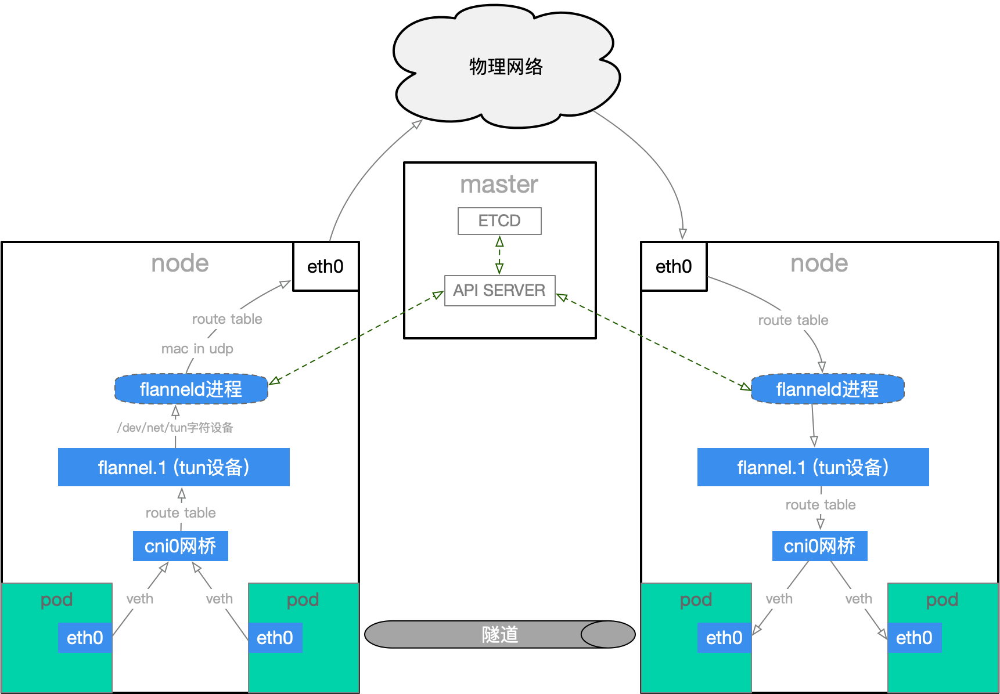
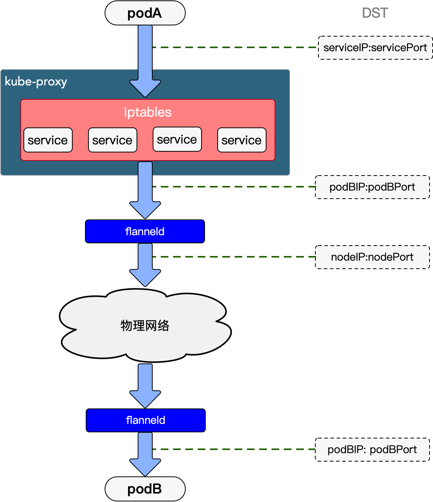

<!--more-->


# k8s网络组件

pod作为k8s的一等公民，拥有自己的网络标识，其中CNI插件专门用于为pod创建大二层网络，每个pod都有CNI分配的其独一无二的网络标识，k8s可以合理调度pod不用担心网络的限制。

通常，pod通过service对外提供服务，这就要求所有到达service的请求都能被正确转发到对应pod上，kube-proxy就负责完成这个工作。

类比于互联网上访问网站，我们希望通过service name就可以访问service而不是要记住各式各样的ip。coreDNS就负责服务发现和域名解析。

本文将对构建k8s网络的组件进行介绍：

- CNI插件
- kube-proxy
- coredns

这三个组件各司其职，帮助我们打通pod间的通讯。


## CNI与overlay网络

我们先从承载pod的overlay网络说起。

> overlay网络是通过网络虚拟化技术，在同一张Underlay网络上构建出的一张或者多张虚拟的逻辑网络。在overlay网络中，设备之间可以通过逻辑链路，按照需求完成互联形成overlay拓扑

通常有两种方案实现overlay网络：

- **隧道方案**：通过Vxlan或UDP封装，实现在一个三层或二层网络中透明传输pod间的二层数据。如flannel的UDP模式和Vxlan模式。
- **路由方案**：通过配置路由规则，实现在一个三层网络中透明传输pod间的二层数据。如calico的方案。

本文以flannel的UDP模式为例，介绍CNI如何创建linux虚拟网络设备并正确转发pod的流量。

首先，flannel以DaemonSet在每个node上运行一个pod。flannel会在每个node创建虚拟网络设备，并为每个pod的基础容器配置网络。

node虚拟网络设备：

- cni0网桥
- flannel.1(tun设备)
- veth pair

pod网络设备：

- eth0(网络接口)
- veth pair

下图为pod to pod通讯流程。



flannel会为pod创建eth0网络接口，通过和node中的cni0网桥设置veth pair，可以把数据传输到node上。每创建一个pod都会创建一对 veth pair。其中一端是pod中的eth0，另一端是cni0。pod从网卡eth0发出的流量都会发送到cni0网桥上。

数据抵达cni0后会根据路由规则(flannel设置)转发到flannel.1上，flannel.1是tun设备，可以想象成flanneld进程埋在内核态的钩子，flanneld需要对数据包进行处理，但flanneld在用户态，linux的网络协议栈在内核态，flannel.1的作用就是把数据包从内核态切换到用户态进行处理。

如果flannel工作在UDP模式，flanned通过socket读取flanne.1数据，处理并发送给对端node的flanneld。如果在vxlan模式中flanned作用是获取必要的mac地址，ip地址信息，没有直接处理数据流。

flanneld维护了一份全局node的网络表，通过flannel.1接收到请求后，根据node表，将请求二次封装为UDP包，扔给eth0，由eth0出口进入物理网路发送给目的node。flanneld和对端flanneld通讯和普通进程间通讯过程一致。

flannel相当于为pod之间通讯建立了一条隧道，所有处理对pod都是透明的，到此一个承载pod的overlay网络搭建完成。


## kube-proxy与service实现

service出现的目的是为了解决以下问题：

- 为pod提供一个稳定的对外服务地址
- 实现简单的负载均衡

kube-proxy就是实现service的k8s组件，实现步骤如下：

- service创建后kube-proxy会去apiserver注册，并保存etcd
- kube-proxy从etcd获取service信息，并把访问规则写入iptables
- 请求根据iptables规则转发到pod，默认使用iptables轮询规则实现负载均衡

可以说，services的本质就是kube-proxy在各个node添加的一系列iptables规则。

```bash
[root@node1 ~]# iptables -t nat -L|grep -i dnat
DNAT       tcp  --  anywhere             anywhere             /* default/prometheus:prometheus */ tcp to:10.244.1.15:9090
DNAT       tcp  --  anywhere             anywhere             /* default/prometheus:prometheus */ tcp to:10.244.1.16:9090
DNAT       tcp  --  anywhere             anywhere             /* default/centos */ tcp to:10.244.2.34:80
```

一个完整的访问流程如下：

1. podA访问service，先通过podA所在node上的iptables nat转化为service对应的podB的ip和port
2. flanneld进程查找podB所在node的ip并通过UDP封装
3. 数据到达podB所在node的flanneld进程，还原为podA发送的数据




这里对比下CNI和kube-proxy：

- CNI创建overlay网络，为所有node和pod分配ip，对应**pod ip**
- kube-proxy通过添加iptables把访问service的请求转发到对应pod，对应service的**cluster ip**


## coreDNS与服务发现

从Kubernetes 1.12开始，CoreDNS就成了Kubernetes的默认DNS服务器。其基于caddy并采用模块化设计，具体功能需要不同插件实现。

```yaml
.:53 {
    errors # 启用错误记录
    health # 启用运行状况检查端点，8080/health
    kubernetes cluster.local in-addr.arpa ip6.arpa { # 处理k8s 域名解析
       pods insecure
       upstream
       fallthrough in-addr.arpa ip6.arpa 
    }
    prometheus :9153 # 启用Prometheus指标。9153/metrics
    forward . /etc/resolv.conf # 通过resolv.conf内的nameservers解析
    cache 30 # 启用缓存，所有内容限制为30秒的TTL
    loop # 检测简单的转发循环并停止服务器
    reload # reload允许自动重新加载已更改的Corefile
    loadbalance # 负载均衡，默认round_robin，
}
```

1. 每个{} 代表一个zone,格式是 “Zone:port{}”, 其中"."代表默认zone,

2. {}内的每个名称代表插件的名称,只有配置的插件才会启用
   当解析域名时，会先匹配zone（都未匹配会执行默认zone），然后zone内的插件从上到下依次执行(这个顺序并不是配置文件内谁在前面的顺序，而是[core/dnsserver/zdirectives.go](https://link.juejin.cn/?target=https%3A%2F%2Fgithub.com%2Fcoredns%2Fcoredns%2Fblob%2Fmaster%2Fcore%2Fdnsserver%2Fzdirectives.go%23L12)内的顺序)，匹配后返回处理（执行过的插件从下到上依次处理返回逻辑），不再执行下一个插件
3. 插件的文档说明请参考: [coredns.io/plugins](https://link.juejin.cn/?target=https%3A%2F%2Fcoredns.io%2Fplugins)


kubernetes会为pod和service创建DNS记录，可使用资源名称直接访问。

- service：`servicename.namespace.svc.clusterDomain`
- pod：`podIp.namespace.pod.clusterDomain` (podIp需要用`-`代替`.`)


# 参考

[官网](https://kubernetes.io/zh/docs/tasks/administer-cluster/dns-debugging-resolution/)

[Linux Tun/Tap 介绍](https://www.zhaohuabing.com/post/2020-02-24-linux-taptun/)

[趣谈网络协议](https://fanlv.wiki/2020/08/25/note/happy-talk-net/)

[CoreDns 介绍和源码解析](https://juejin.cn/post/6844903854799061006)