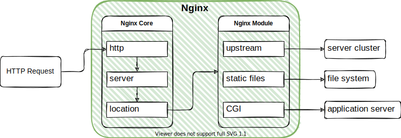

<!--more-->

本文只聚焦在http配置块

# nginx如何处理一个请求

nginx可以处理三种类型的请求：

- [HTTP](<https://nginx.org/en/docs/http/ngx_http_core_module.html#http>) – HTTP traffic
- [MAIL](<https://nginx.org/en/docs/mail/ngx_mail_core_module.html#mail>) – Mail traffic
- [stream](<https://nginx.org/en/docs/stream/ngx_stream_core_module.html#stream>) – TCP and UDP traffic

其中HTTP和MAIL都是应用层协议，nginx通过响应的模块对其进行解析。stream为tcp/ip协议，通过ngx_stream_core_module模块使nginx可以作为四层负载均衡使用。

nginx= core + module

Nginx core实现了底层的通讯协议，为其他模块和 Nginx 进程构建了基本的运行时环境，并且构建了其他各模块的协作基础。

当core接到一个HTTP请求时，core仅仅是通过查找配置文件将此次请求映射到一个 location block，而此location 中所配 置的各个指令则会启动不同的模块去完成工作，因此模块可以看做Nginx真正的劳动工作者。

通常一个location中的指令会涉及一个handler模块和多个filter模块，handler模块负责处理请求，完成响应内容的生成，而filter模块对响应内容进行处理。

ngx_http_core_module

ngx_http_upstream_module

# 虚拟服务器

## location

# 参考

[Nginx Cheatsheet](https://vishnu.hashnode.dev/nginx-cheatsheet#load-balancing)

[官方文档](http://nginx.org/en/docs/)

