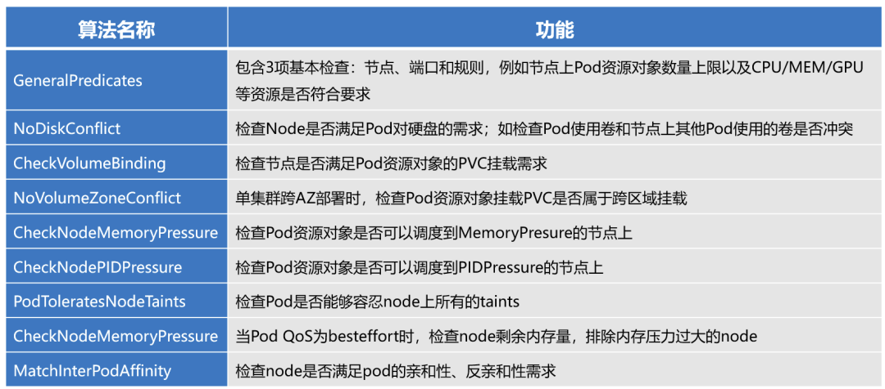
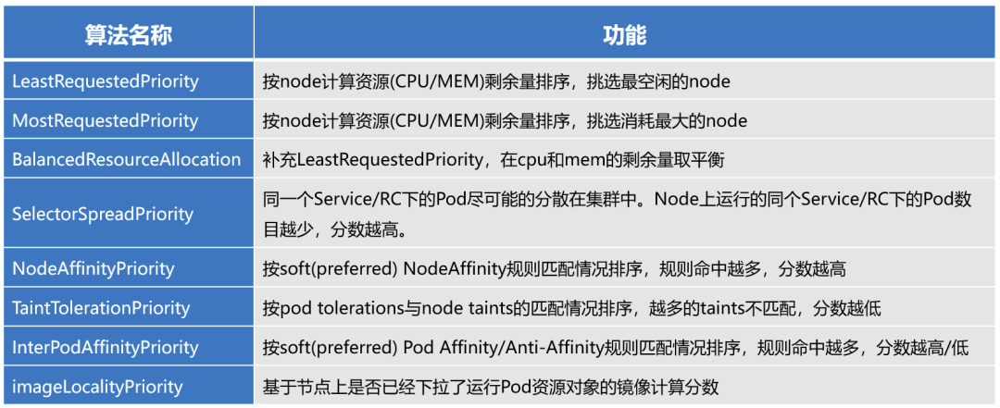

<!--more-->

本文介绍k8s pod 调度的基本原理，详细介绍具体pod调度相关的配置。


# kube-scheduler

kube-scheduler作为k8s负责任务调度的组件，以pod的形式运行在master节点上，主要职责是为pod选出合适的node进行调度，其调度过程可以简化为如下两步：

- 使用Predicate算法筛选出合适的node，避免资源冲突、节点超载、端口的冲突等
- 使用Priority算法为每个node打分，得分最高的node填入pod对象字段（`pod.spec.nodeName`）

**Predicate算法：**



**Priority算法：**



从kube-scheduler调度流程可以看出，node的资源、标签、taint和pod的affinity、标签对调度结果起到调节作用，如下图所示。接下来通过例子详细介绍这些配置。


# pod调度配置

> pod调度指将pod调度到合适的node。

kube-scheduler默认会根据node资源情况进行筛选，挑出符合条件的node。我们还可以通过设置亲和性自定义复杂的调度策略，本质上还是通过node和pod的标签进行筛选和调度。pod是最小调度单位，所有跟调度和资源管理相关属性都属于pod对象字段，汇总如下：

**`pod.spec.`**

- `nodeSelector` *map[string]string*
- `nodeName` *string*
- `tolerations` *[]Object*

- `priorityClassName` *string*


**`pod.spec.affinity.`**

- `nodeAffinity` *Object*
- `podAffinity` *Object*
- `podAntiAffinity ` *Object*


**`pod.spec.containers.`**

- `resources ` *Object*

## node资源

通过node上的计算资源来限定pod的调度。

### resources

`resources.`

- `requests` *map[string]string*
- `limits` *map[string]string*

k8s在调度时，按照requests值进行计算，配置Cgroups时按照limits值设置。

由于大多数应用使用的资源要小于时间使用的资源，所以requests设置较小的值，让pod可以顺利调度到node，设置Cgroups时取一个可能使用到的值。即`requests<=limits`。

不同的requests和limits会影响到pod的QOS级别。

### QOS

> QOS定义pod的服务质量，当node资源紧张时，kubelet根据QOS等级来调度和驱逐pod

根据`pod.spec.resources`设置，`pod.status.qosClass`被指定如下等级：

- `Guaranteed` 配置了requests和limits，且requests=limits
- `Burstable`  不满足Guaranteed，但至少配置一个requests
- `BestEffort` 没配置requests和limits

驱逐优先级：`BestEffort` → `Burstable` → `Guaranteed`

cpuset可以把容器绑定到某个cpu核心上从而减少cpu上下文切换次数，默认为cpushare。

配置cpuset：

- 必须是`Guaranteed` pod
- pod的`requests.CPU=limists.CPU`

如下：

```yaml
spec:
  containers:
  - name: nginx
    image: nginx
    resources:
      limits:
        memory: "200Mi"
        cpu: "2"
      resources:
        memory: "200Mi"
        cpu: "2"
```

## node标签


### nodeName 

`pod.spec.nodeName` *string*

> nodeName 是比亲和性或者 nodeSelector 更为直接的形式。nodeName 是 Pod 规约中的一个字段。如果 nodeName 字段不为空，调度器会忽略该 Pod， 而指定节点上的 kubelet 会尝试将 Pod 放到该节点上。 使用 nodeName 规则的优先级会高于使用 nodeSelector 或亲和性与非亲和性的规则。

```yaml
apiVersion: v1
kind: Pod
metadata:
  name: nginx
spec:
  containers:
  - name: nginx
    image: nginx
  nodeName: kube-01
```

### nodeSelector

`pod.spec.nodeSelector` *map[string]string*

> 通过node标签筛选

```yaml
apiVersion: v1
kind: Pod
metadata:
  name: nginx
  labels:
    env: test
spec:
  containers:
  - name: nginx
    image: nginx
    imagePullPolicy: IfNotPresent
  nodeSelector: # 如果没有符合label的node，pod不会被调度
    disktype: ssd
```

### 污点和容忍度

> node的taint和pod的tolerations相互配合，可以完成很多负载调度工作

一个节点可以有多个污点，而 pod 可以有多个容忍度。Kubernetes 处理多个 taints 和 toleration 的方式就像一个过滤器：从节点的所有 taint 开始，然后忽略 pod 具有匹配 toleration 的那些；剩余的未被忽略的污点对 pod 有特定的影响。

为node打上污点：

`kubectl taint nodes <node_name> key=value:effect`

`<taintKey>=<taintValue>:<taintEffect>`

```bash
# 例子
kubectl taint nodes kube-worker2 new-taint=taint_demo:NoExecute
kubectl taint node kube-worker2 new-taint:NoExecute- # 删除污点
```

可以分配三个不同的值effect：

- NoSchedule：如果至少有一个未被忽略的污点NoSchedule生效，那么 Kubernetes 不会将 pod 调度到该节点上。已经存在的不容忍这种污点的 Pod 不会被从该节点驱逐或删除。但是除非有匹配的容忍度，否则不会在这个节点上安排更多的 Pod。这是一个硬约束。
- PreferNoSchedule：如果至少有一个不可容忍的污点有影响，Kubernetes 将尝试不在节点上调度 Pod 。但是如果有一个 pod 可以容忍一个 taint，它可以被调度。这是一个软约束。
- NoExecute：如果至少有一个未被忽略的NoExecute taint 生效，那么 Pod 将从节点中被逐出（如果它已经在节点上运行），并且不会被调度到节点上（如果它还没有在节点上运行）节点）。这是一个强约束。

配置tolerations：

`pod.spec.tolerations` *Object*

```bash
# 例子
apiVersion: v1
kind: Pod
metadata:
  name: nginx-toleration-demo
  labels:
    env: staging
spec:
  containers:
  - name: nginx
    image: nginx
    imagePullPolicy: IfNotPresent
  tolerations:
  - key: "new-taint"
    operator: "Equal" #operator的默认值为Equal，还可以使用Exists（可以对value使用通配符匹配）
    value: "taint_demo"
    effect: "NoSchedule"
```

### nodeAffinity

**`pod.spec.affinity.`**

- `nodeAffinity`

  > 节点亲和性

  - `requiredDuringSchedulingIgnoredDuringExecution` *Object*

     指定规则（node的label）

    - `nodeSelectorTerms`
      - `matchExpressions` *[]Object*
      - `matchFields` *[]Object*
    
  - `preferredDuringSchedulingIgnoredDuringExecution`  *[]Object*
  
     根据权重，优先调度（node的label）
  
    - `preference`
      - `matchExpressions` *[]Object*
      - `matchFields` *[]Object*
  
    - `weight` 1-100
  
  运算符包括 `In、NotIn、Exists、DoesNotExist、Gt、Lt`
  
  例子：
  
  ```yaml
  # pod 只会被调度到具有 disktype=ssd 标签的节点上
  apiVersion: v1
  kind: Pod
  metadata:
    name: nginx
  spec:
    affinity:
      nodeAffinity:
        requiredDuringSchedulingIgnoredDuringExecution:
          nodeSelectorTerms:
          - matchExpressions: # disktype=ssd
            - key: disktype
              operator: In
              values:
              - ssd            
    containers:
    - name: nginx
      image: nginx
      imagePullPolicy: IfNotPresent
  ---
  # pod 将首选调度到具有 disktype=ssd 标签的节点
  apiVersion: v1
  kind: Pod
  metadata:
    name: nginx
  spec:
    affinity:
      nodeAffinity:
        preferredDuringSchedulingIgnoredDuringExecution: 
        - weight: 1
          preference:
            matchExpressions: # disktype=ssd 
            - key: disktype
              operator: In
              values:
              - ssd          
    containers:
    - name: nginx
      image: nginx
      imagePullPolicy: IfNotPresent
  ---
  # 节点必须满足os=linux，再根据权重排序
  apiVersion: v1
  kind: Pod
  metadata:
    name: with-affinity-anti-affinity
  spec:
    affinity:
      nodeAffinity:
        requiredDuringSchedulingIgnoredDuringExecution:
          nodeSelectorTerms:
          - matchExpressions: # os=linux
            - key: kubernetes.io/os 
              operator: In
              values:
              - linux
        preferredDuringSchedulingIgnoredDuringExecution:
        - weight: 1
          preference:
            matchExpressions: # lable-1=key-1
            - key: label-1
              operator: In
              values:
              - key-1
        - weight: 50
          preference:
            matchExpressions: # label-2=key-2
            - key: label-2
              operator: In
              values:
              - key-2
    containers:
    - name: with-node-affinity
      image: k8s.gcr.io/pause:2.0
  ```

## pod标签

### podAffinity podAntiAffinity

> pod间亲和性 pod反亲和性最佳实践之一是通过将 Pod 分布在不同的可用区来避免单点故障 配合Deployment和StatefulSet使用 Pod 间亲和性与反亲和性使你可以基于已经在节点上运行的 Pod 的标签来约束 Pod 可以调度到的节点，而不是基于节点上的标签。

**`pod.spec.affinity.`**

- `podAffinity` `podAntiAffinity`

  - `requiredDuringSchedulingIgnoredDuringExecution`  *[]Object*

    - `labelSelector` *Object* pod标签选择器
    - `namespaceSelector` *Object* namespace标签选择器
    - `namespaces` *[]string* namespace name list
    - `topologyKey` *string* 
  
      > *pod affinity的调度范围为topology，topologyKey用来定义pod affinity同一位置的含义，如果为hostname，即同一位置为同一node*

  - `preferredDuringSchedulingIgnoredDuringExecution` *[]Object*

    - `podAffinityTerm` *Object*
      - `labelSelector` *Object*
      - `namespaceSelector` *Object*
      - `namespaces` *[]string*
      - `topologyKey` *string*
      
    - `weight` 1-100
    
    
  
  ```yaml
  apiVersion: apps/v1
  kind: Deployment
  metadata:
    name: web-server
  spec:
    selector:
      matchLabels:
        app: web-store
    replicas: 3
    template:
      metadata:
        labels:
          app: web-store # app=web-store
      spec:
        affinity: # 不和app=web-store的pod在一个node上，和app=store的pod在同一个node上
          podAntiAffinity:
            requiredDuringSchedulingIgnoredDuringExecution:
            - labelSelector:
                matchExpressions: # app=web-store
                - key: app
                  operator: In # In, NotIn, Exists and DoesNotExist
                  values:
                  - web-store
              topologyKey: "kubernetes.io/hostname"
          podAffinity:
            requiredDuringSchedulingIgnoredDuringExecution:
            - labelSelector:
                matchExpressions: # app=store
                - key: app
                  operator: In
                  values:
                  - store
              topologyKey: "kubernetes.io/hostname"
        containers:
        - name: web-app
          image: nginx:1.16-alpine
  ---
  apiVersion: apps/v1
  kind: Deployment
  metadata:
    name: redis-cache
  spec:
    selector:
      matchLabels:
        app: store
    replicas: 3
    template:
      metadata:
        labels:
          app: store # app=store
      spec:
        affinity: # 不和app=store的pod在同一node上
          podAntiAffinity:
            requiredDuringSchedulingIgnoredDuringExecution:
            - labelSelector:
                matchExpressions:
                - key: app
                  operator: In
                  values:
                  - store
              topologyKey: "kubernetes.io/hostname"
        containers:
        - name: redis-server
          image: redis:3.2-alpine
  ```
  
  调度效果:
  
  

# 参考

[深入剖析Kubernetes](https://book.douban.com/subject/35424872/)

[官网](https://kubernetes.io/zh-cn/docs/concepts/scheduling-eviction/assign-pod-node/)
